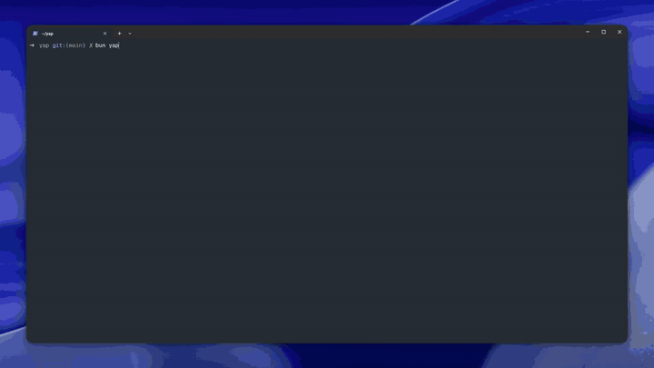

# YAP

```
██╗   ██╗      █████╗          ██████╗
╚██╗ ██╔╝     ██╔══██╗         ██╔══██╗
 ╚████╔╝      ███████║         ██████╔╝
  ╚██╔╝       ██╔══██║         ██╔═══╝
   ██║ou      ██║  ██║utomate  ██║ages
   ╚═╝        ╚═╝  ╚═╝         ╚═╝
```

A local HTTP-first YAML runtime for fetching HTML or JSON, scraping named fields, paginating, and returning JSON.



- [Features](#features)
- [Requirements](#requirements)
- [Install](#install)
- [First run](#first-run)
- [CLI](#cli)
- [Write a workflow](#write-a-workflow)
- [Use YAP as a library](#use-yap-as-a-library)
- [What this is not](#what-this-is-not)
- [Origin](#origin)

YAP is one Node 22 ESM package named `yap`. You describe a web task in YAML. The engine fetches with `createFetchClient`. It scrapes named fields, paginates, and returns JSON. The CLI and the library share `executeWorkflow`.

> [!NOTE]
> YAP has no browser in this PoC. It uses HTTP plus Cheerio for HTML or JSON scraping.

## Features

- YAML workflows for HTTP requests, named scrapers, datasets, and steps
- HTML scrape with Cheerio
- JSON scrape with dotted `path` fields
- Page and cursor pagination
- `each` over list inputs
- YAML file inputs and `--input name=value`
- TTY prompts or a workflow file on the command line
- Custom `HttpClient` in the library
- JSON result on stdout and a path-mirrored output file for CLI runs
- Per-cell source beside the run, with `yap explain`

## Requirements

- Node.js 22 or newer
- npm, pnpm, or bun, for install

## Install

YAP is not published to npm. Run it from this repository.

```bash
npm install
```

`pnpm install` and `bun install` work the same.

## First run

Run the checked-in HTML pagination workflow:

```bash
npm run yap -- run workflows/examples/web-scraping.dev/products.yaml
```

The workflow GETs `https://web-scraping.dev/products` and scrapes product cards. A second step paginates from page 2 for up to 5 requests. It stops early when a page returns no items.

On success you should see JSON on stdout, `Saved output/examples/web-scraping.dev/products.json` on stderr, `Saved output/examples/web-scraping.dev/products.health.json` on stderr, `Saved output/examples/web-scraping.dev/products.source.json` on stderr, and `Logged logs/examples/web-scraping.dev/products.log` on stderr.

> [!TIP]
> A file on the command line always prints JSON on stdout. Interactive run (TTY, no file) asks whether to view the result first. Spinner ticks go to stderr only when stderr is a TTY.

To build the package and run the built CLI:

```bash
npm run build
node dist/cli.js run workflows/examples/web-scraping.dev/products.yaml
```

The built package exposes the `yap` bin through `dist/cli.js`. That path is Node. `tsc` still emits `dist/` for npm and `import "yap"`.

Checked-in examples live under `workflows/examples`, grouped by site hostname. `yap create` still writes new files to `workflows/`.

Other examples:

- `workflows/examples/webscraper.io/paginated-cars.yaml` uses HTML page pagination and timestamped output.
- `workflows/examples/pokeapi.co/pokemon-details.yaml` uses JSON scraping, `each`, and the YAML file input `inputs/pokemon.yaml`.
- `workflows/examples/web-scraping.dev/graphql-reviews.yaml` uses JSON scraping and cursor pagination for a GraphQL request.

```bash
npm run yap -- inspect workflows/examples/web-scraping.dev/products.yaml
```

`inspect` prints a summary. For `products.yaml` that looks like:

```
Name: products
Description: Paginated products from https://web-scraping.dev/products
Version: 1
Scrapers: product
Datasets:
  products - Products
    initial-page  GET https://web-scraping.dev/products
    remaining-pages  GET https://web-scraping.dev/products?page={{ pagination.next }} (paginated)
```

## CLI

The package CLI uses these forms:

```text
yap
yap run
yap run <file.yaml> [--input name=value]
yap inspect
yap inspect <file.yaml>
yap create
yap create <name>
yap explain <path>
yap health [file.yaml]
yap drift [file.yaml]
```

`yap` with no arguments starts an interactive TTY loop. It lists YAML files under `workflows/`, then an action menu for the file you pick. After Run, Inspect, Health, or Explain, you stay on that file. Back returns to the list. Create and Other file… live on the workflow list, not on the per-file menu.

`yap run` and `yap inspect` pick a workflow, do that action once, then stay on that file's action menu. `yap create` writes a stub, then shows the workflow list. `yap inspect <file.yaml>` prints a summary. `yap create <name>` writes `workflows/<name>.yaml` without entering the TTY loop.

`yap run <file.yaml>` prints JSON on stdout. `Saved <path>` and `Logged <path>` messages go to stderr. Extraction health also goes to stderr: a short table when stderr is a TTY, plus `YAP_EXTRACTION_FAILED` or `YAP_EXTRACTION_DEGRADED` when contracts fail or degrade. Interactive run asks `View result?` before printing JSON. A step or extraction failure in the TTY loop is logged. It does not exit the session.

`yap explain "<dataset>.<scrape>[row].<field>"` finds the newest `*.source.json` under `{cwd}/output/` by mtime and prints that cell. Missing run prints `YAP_EXPLAIN_NO_RUN` and exits 1. Missing path prints `YAP_EXPLAIN_NOT_FOUND` and exits 1.

`yap health` prints the newest `*.health.json` table. Pass a workflow file to scope it. Missing run prints `YAP_HEALTH_NO_RUN` and exits 1. A TTY Run already prints that table on stderr when stderr is a TTY, or when extraction is degraded or failed. The Health action in the TTY loop is the same report plus drift when a previous sidecar exists.

`yap drift` compares that health file to the previous run. Previous is `*.prev.health.json` after a non-timestamped overwrite, or the next-newest timestamped health file. Match rate falling from `>= 80%` to `<= 20%` is severe drift and exits 1. No previous run prints `YAP_DRIFT_NO_PREVIOUS` and exits 1.

Pass an input as `--input name=value`. Unknown flags fail with `WorkFlowValidationError`. Use `-h` or `--help` for usage. With no file in a non-TTY, YAP prints usage and exits 1.

`yap create <name>` writes `workflows/<name>.yaml`. The stub has empty `scrapers: {}` and `data: {}`. It is valid YAML, but it is not a runnable workflow until you fill those sections.

The CLI reports `YAP_WORKFLOW_INVALID` for `WorkFlowValidationError`. It reports `YAP_STEP_FAILED` for `StepExecutionError` and prints the step id, URL, and reason. Status is printed when the transport has one.

For repository development, `npm run yap` runs `src/cli.ts` through `tsx`. After `npm run build`, `node dist/cli.js` is the same CLI.

## Write a workflow

A workflow has `version`, `name`, `scrapers`, and `data`. It can also have an optional `description`, `input`, `output`, and `logging`.

This excerpt follows `workflows/examples/web-scraping.dev/products.yaml`:

```yaml
version: 1.0
name: products
description: "Paginated products from https://web-scraping.dev/products"

scrapers:
  product:
    fields:
      title:
        selector: "h3 a"
      href:
        selector: "h3 a"
        getter:
          type: attribute
          value: "href"
      price:
        selector: ".price"

data:
  products:
    name: "Products"
    steps:
      - id: initial-page
        request:
          method: GET
          url: "https://web-scraping.dev/products"
        scrape:
          - id: products
            selector: "div.row.product"
            many: true
            using: product

      - id: remaining-pages
        pagination:
          next: page
          start: 2
          max: 5
          stop_when: [empty_items]
        request:
          method: GET
          url: "https://web-scraping.dev/products?page={{ pagination.next }}"
        scrape:
          - id: products
            selector: "div.row.product"
            many: true
            using: product
```

The checked-in file also sets `logging`.

HTML is the default scraper format when `format` is omitted. HTML fields can use `selector`, `index`, and a getter for text or an attribute. Set `required: true` on a field when a missing value should change extraction health. Omitted `required` is false. `null` and `""` count as missing. One missing required value on a row does not stop the run. After the run, a required field that matched 0 times is an extraction failure. A required field missing on only some rows is degraded.

JSON scrapers set `format: json`. Their fields use dotted `path` values:

```yaml
scrapers:
  pokemon-json:
    format: json
    fields:
      name:
        path: name
```

A scrape operation has `id`, `selector`, and `using`. `many` is optional and defaults to `true`. Request methods are `GET`, `POST`, `PUT`, and `DELETE`.

A step can set `scrape: []` to send the request and keep cookies without extracting rows. Omit `scrape` for the same effect. Put that step first when the site sets a session cookie before the catalog request. Pagination is not allowed on a step with no scrape operations.

### Pagination and inputs

Use `next: page` with `start`, `max`, and `stop_when: [empty_items]` for page pagination. Use `next: cursor` with `from: scrapeId.field` for cursor pagination.

Use `each: input.<id>` to iterate a list input. Inputs can come from YAML files or from `--input name=value`.

### Interpolation

Use these templates in `step.request` and in `step.output`.

- `{{ input.x }}` reads a resolved input.
- `{{ pagination.next }}` reads the current page or cursor.
- Earlier scrape rows use `{{ scrapeId.field }}` or `{{ stepId.scrapeId.field }}`.
- After a prior step finishes, use `{{ response.url }}`, `{{ response.status }}`, `{{ request.url }}`, or `{{ stepId.response.url }}`.

`createFetchClient` follows redirects. `response.url` is the landing URL. `response.status` is the final status, usually 200 after a 302. A custom client that returns 302 can still expose `{{ response.headers.location }}`.

Do not name a scrape id or a step id `input`, `pagination`, `request`, or `response`. Load rejects those ids.

`step.output` is the spinner label on each tick. Write `Landed {{ response.url }} ({{ response.status }})` when you want the landing URL in the spinner. It is not the JSON file under `output/`. That file contains scrape rows only.

### Output and logging

Every CLI file run writes JSON under `output/`, a health sidecar, and a source sidecar next to them. The path mirrors the workflow path below `workflows/` and drops the `.yaml` or `.yml` suffix. For example, `workflows/examples/web-scraping.dev/products.yaml` writes `output/examples/web-scraping.dev/products.json`, `output/examples/web-scraping.dev/products.health.json`, and `output/examples/web-scraping.dev/products.source.json`. A workflow outside `workflows/` uses its basename. Stdout is still the row JSON only. A required field that matched 0 times still writes those files, then exits 1.

Root `output` only configures the optional `use-timestamps` boolean, which defaults to `false`:

```yaml
output:
  use-timestamps: true
```

When enabled, YAP appends local `YYYY-MM-DD-HH-mm-ss` to the file stem. JSON, health, source, and HTTP logs from the same run share that stem.

Set `logging.level` to `INFO` or `DEBUG` to write HTTP logs under the matching `logs/` tree. `step.output` is a spinner label template. It is not a dump of every row.

The schema lives in [`src/workflow/schema.ts`](src/workflow/schema.ts).

## Use YAP as a library

```ts
import { createFetchClient, executeWorkflow, loadWorkflowFromFile, parseHtml } from "yap";

const workflow = loadWorkflowFromFile("workflows/examples/web-scraping.dev/products.yaml");
const { data, health, sources } = await executeWorkflow(workflow, {
  http: createFetchClient(),
  parseHtml,
});

console.log(JSON.stringify(data, null, 2));
console.log(health.status);
console.log(Object.keys(sources.cells).length);
```

`executeWorkflow(workflow, deps)` requires `deps.http`. Pass a custom `HttpClient` when you want to wrap `fetch`. JSON-only workflows can omit `parseHtml`. It returns `{ data, health, sources }`. `data` is the row map. `health` is field match counts and `healthy | degraded | failed`. `sources` is a map of cell paths to source hop, step, scraper, and selector. Rows stay plain values.

`createFetchClient()` is a session. It stores `Set-Cookie` and sends matching cookies on later requests from that same client. The CLI uses one client per run. A workflow `headers.Cookie` value is sent after the jar cookies. There is no YAML switch to turn the jar off.

The package also exports `loadWorkflow`, `createFetchClient`, `parseHtml`, `parseJson`, `toHealth`, `compareHealth`, `lookupCell`, `formatCell`, `resolveInputs`, `interpolate`, workflow schemas, workflow types, health types, source types, and `HttpTransportError`, `StepExecutionError`, and `WorkFlowValidationError`.

## What this is not

YAP is not Crawlee, Playwright Test, Browse AI, or n8n. There is no browser in this PoC. The runtime uses HTTP plus Cheerio for HTML or JSON scraping.

## Origin

YAP originated in [JScrapeON](https://github.com/johnalbert-dot-py/JScrapeON).
