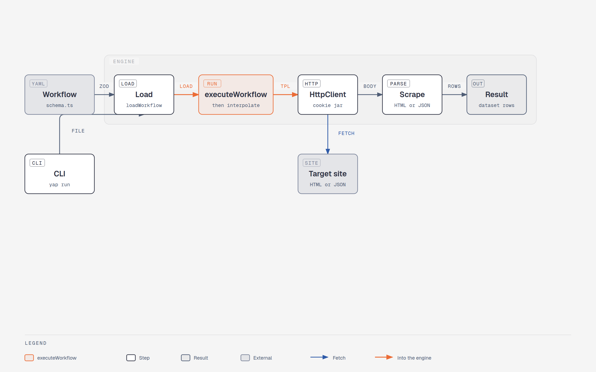
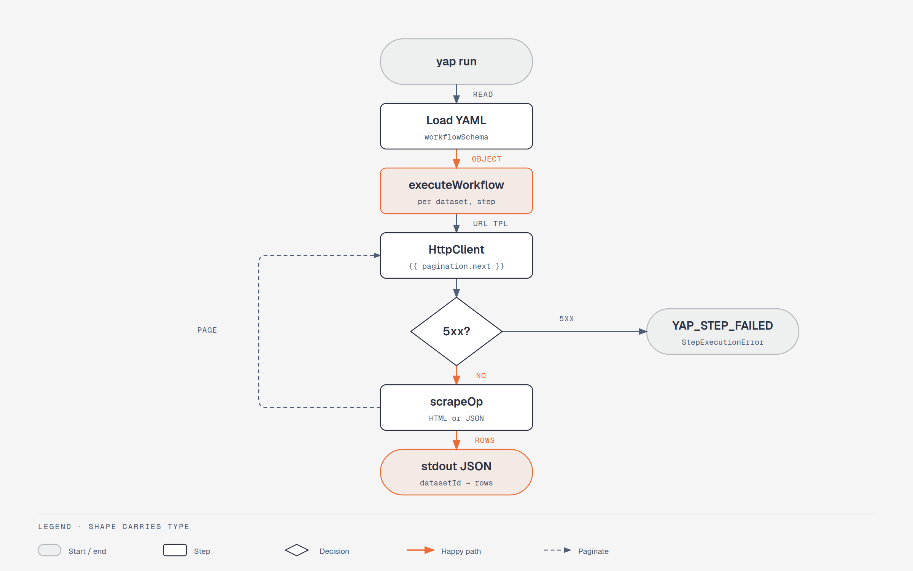

# YAP architecture

YAP is an HTTP-first YAML runtime. The CLI and the library share `executeWorkflow`.

## What the pictures skip

Rows in `data` stay plain values. Sources and health are siblings, not columns on those rows.

- `executeWorkflow` returns `{ data, health, sources }`.
- A CLI file run writes `output/…json`, `*.health.json`, and `*.source.json`.
- `yap explain` prints a cell from the newest source sidecar. The path is `datasetId.scrapeId[row].field`.
- `required: true` fields feed health. Zero matches on an attempted required field is `failed`. Some misses is `degraded`.
- `yap drift` compares the current health file to the previous one.
- `createFetchClient` keeps a cookie jar and follows redirects. There is no browser. Cheerio parses HTML. JSON-only workflows can omit `parseHtml`.
- Inner `executeOnce`, `executeStep`, and `executeDataset` are not exported.

## Source tree

- `src/cli.ts` and `src/cli/` dispatch commands, write files, and run the TTY loop.
- `src/runtime/execute.ts` is the engine. `pagination.ts` sits beside it.
- `src/workflow/schema.ts` is the YAML contract. `types.ts` is `z.infer`. `load.ts` parses the file.
- `src/scrape/` is HTML, JSON, health, and cell sources.
- `src/http/` is `HttpClient` and the cookie jar.
- `src/error.ts` is the three public error classes.
